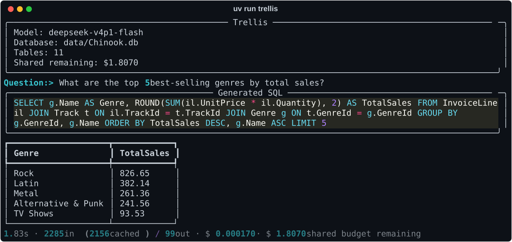
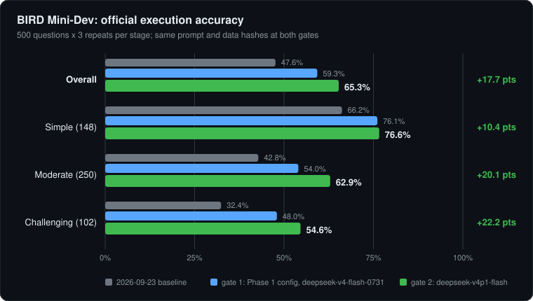
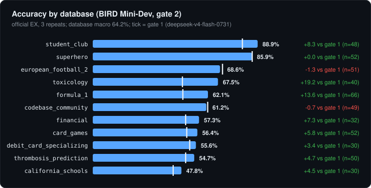
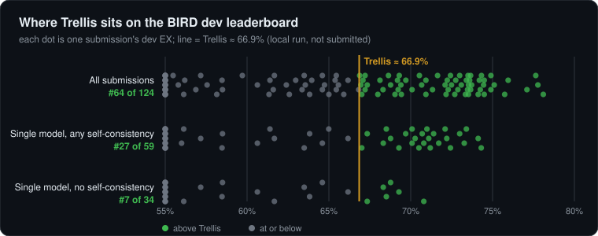
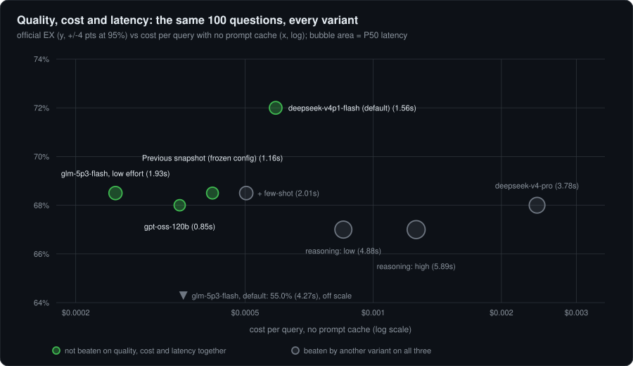
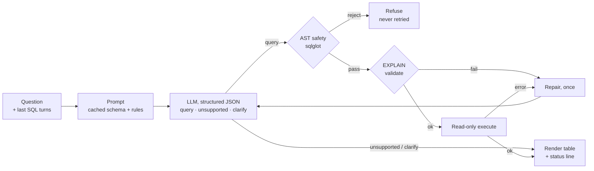
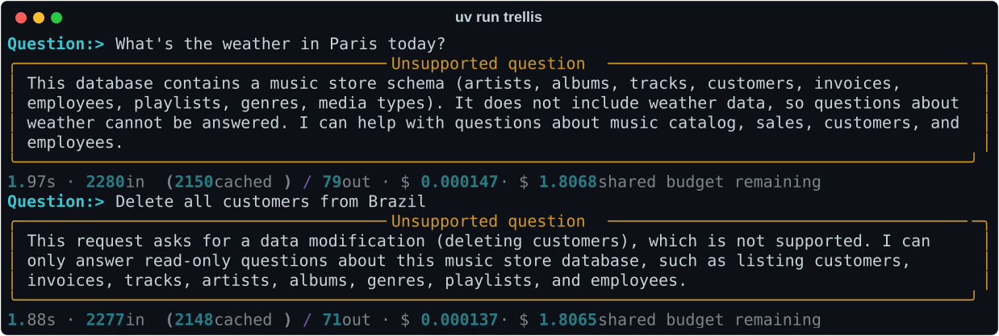
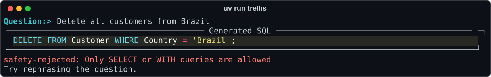

<div align="center">

# Trellis

**A schema-grounded, safety-first text-to-SQL agent. Bounded, instrumented, and measured against BIRD.**




</div>

Trellis turns a question into SQL that is grounded in the database's real schema. A SQL-AST
safety layer checks that SQL before it touches the database. It runs read-only, repairs itself
at most once, and reports latency, tokens and cost for every answer under a hard spend ceiling.
The schema is the trellis: a structure the model's output has to grow along, so the
architecture optimises for grounding, not just raw model capability.

## Results

<!-- BEGIN generated:headline -->
| | BIRD Mini-Dev | BIRD dev, untouched | Both, row-weighted |
|---|---:|---:|---:|
| **Official execution accuracy** | **65.3%** | **67.6%** | **≈ 66.9%** |
| Questions × repeats | 500 × 3 | 1,036 × 1 | 1,536 rows |
| Simple / moderate / challenging | 76.6 / 62.9 / 54.6 | 71.0 / 55.6 / 65.1 | n/a |
| P50 / P90 latency | 1.36s / 2.79s | 1.37s / 3.03s | n/a |
| Cost per query, as measured | $0.000205 | $0.000167 | n/a |
| Cost per query, no prompt cache | $0.000661 | $0.000638 | $0.000651 |
| Per 1,000 queries: measured / no cache | $0.20 / $0.66 | $0.17 / $0.64 | n/a |
<!-- END generated:headline -->

Default model `deepseek-v4p1-flash` with reasoning off and the frozen Phase 1 configuration; every run
is on a clean commit. Tables here are regenerated from the committed reports by
[`scripts/render_readme_assets.py`](scripts/render_readme_assets.py), and each run's finish time, commit,
tree state, config and data hashes are in [`docs/PROVENANCE.md`](docs/PROVENANCE.md).

- **History on Mini-Dev:** 47.6% (baseline) → 59.3% (Phase 1 prompt and pipeline changes) →
  **65.3%** (same config and prompt hash on the current default model).
- **Why this default:** on the paired 500-question Mini-Dev comparison it beats the previous snapshot by
  **+5.9 [+3.2, +8.7]** points and ties on `train_dev` (+0.4 [−1.9, +2.7]). It is slower (P50 1.36s vs
  0.97s) and about a third dearer with no cache. The previous snapshot is a dated model providers
  retire, so it is kept for provenance only. `gpt-oss-120b` is the cheaper, faster alternative.
- **Scope:** official BIRD comparator (`set(pred) == set(gold)`), local runs, **not a leaderboard
  submission**. Mini-Dev skews harder than `dev_untouched`, which is why the two numbers differ.





## Where this stands on the BIRD leaderboard

Compared with the [BIRD leaderboard](https://bird-bench.github.io/) as read on 2026-09-26 (execution
accuracy with oracle knowledge, dev set), Trellis's ≈ 66.9% dev estimate lands mid-table overall and in the
top quarter of its true peers: single models with no self-consistency.

<!-- BEGIN generated:leaderboard -->
| Peer group | Entries with a dev score | Trellis would rank | Best entry (dev / test) |
|---|---:|---:|---|
| All submissions | 123 | **#64** of 124 | DataGallery-Text2SQL (78.1 / 82.4) |
| Single model, any self-consistency | 58 | **#27** of 59 | SiriusAI-SQL (74.3 / 76.5) |
| Single model, no self-consistency | 33 | **#7** of 34 | Databricks RLVR 32B (70.8 / 73.6) |

Estimated cost and latency for the identifiable systems in that group. **These are estimates, not runs**: one call with our measured prompt (about 1,900 input and 75 output tokens), list prices, no prompt cache on either side, and a roofline model for latency (method and sources in [`docs/PEER_ESTIMATES.md`](docs/PEER_ESTIMATES.md)). Submitted pipelines often make several calls with longer prompts, so their real cost is higher.

| System | Dev EX | Test EX | Est. cost / query | vs Trellis | Est. latency | vs Trellis |
|---|---:|---:|---:|---:|---:|---:|
| Databricks RLVR 32B | 70.8 | 73.6 | $0.00178 | 2.7× | 1.4–2.0s | 1.0–1.5× |
| SQLWeaver-32B | 69.3 | 71.7 | $0.00178 | 2.7× | 1.4–2.0s | 1.0–1.5× |
| Claude Opus 4.6 (baseline) | 68.8 | 70.2 | $0.01139 | 17.2× | 2.4–2.9s | 1.8–2.2× |
| Arctic-ExCoT-70B | 68.5 | 68.5 | $0.00178 | 2.7× | 1.7–2.5s | 1.2–1.8× |
| Arctic-ExCoT-32B | 68.3 | 68.2 | $0.00178 | 2.7× | 1.4–2.0s | 1.0–1.5× |
| Claude 4.5 Sonnet (baseline) | 67.3 | 66.8 | $0.00683 | 10.3× | 2.3–2.8s | 1.7–2.1× |
| **Trellis** (measured, not submitted) | **≈ 66.9** | not submitted | **$0.00066** ($0.00020 cached) | 1× | **1.36s** | 1× |
| OneSQL-v0.1-Qwen-32B | 64.6 | 63.3 | $0.00178 | 2.7× | 1.4–2.0s | 1.0–1.5× |
| Command A (111B) | 63.5 | 65.7 | $0.00178 | 2.7× | 2.5–3.8s | 1.8–2.8× |
| SFT CodeS-15B | 58.5 | 60.4 | $0.00040 | 0.6× | 0.8–1.1s | 0.6–0.8× |
<!-- END generated:leaderboard -->



- **Read the rank with care.** Leaderboard dev scores are self-reported, and Trellis was not submitted, so
  it has no test score. The top entries score 4–7 points higher on test than on dev.
- **Peers.** The six systems above Trellis in its group are four 32–70B models plus two frontier
  closed-model baselines. Trellis is one open-weight model, one sample per question, about $0.0002 per
  query measured. Many top entries add many-candidate self-consistency, which multiplies cost.
- **Cost and latency.** The leaderboard publishes neither. The table above estimates them for the
  identifiable peers (nothing was run), and the next section measures our own configurations.

## Quality, cost and latency

Every variant is scored on all three axes. The chart puts the same 100 stratified `train_dev` questions
through each one, so the variants are directly comparable. The table below it is the full-run version for the
configurations that reached one (1,002 answers on four databases the prompts were never tuned on).



<!-- BEGIN generated:pareto -->
| Configuration | Official EX | P50 | P90 | $/query measured | $/query no cache | $ per 1k (no cache) | Verdict |
|---|---:|---:|---:|---:|---:|---:|---|
| Baseline, product prompt (`deepseek-v4-flash-0731`) | 60.1% | n/v | n/v | $0.000293 | $0.000511 | $0.51 | starting point |
| + benchmark prompt profile | 67.1% | 1.22s | 8.46s | $0.000278 | $0.000467 | $0.47 | adopted |
| + quoting + pipeline repairs (the frozen config) | 68.7% | 1.05s | 8.46s | $0.000398 | $0.000497 | $0.50 | adopted |
| **same config on `deepseek-v4p1-flash` (default)** | 69.4% | 1.50s | 3.03s | $0.000141 | $0.000696 | $0.70 | **default**: ties here, +5.9 on Mini-Dev |
| `gpt-oss-120b`, low effort, same config | 67.3% | 0.97s | 1.93s | $0.000166 | $0.000398 | $0.40 | cheaper and faster; misses the non-inferiority margin |
<!-- END generated:pareto -->

*n/v: latency for the baseline run is invalid, because synchronous scoring blocked the event loop.
"No cache" prices every prompt token at the full rate, computed from recorded token counts. It is the
fair cost axis: provider cache hits swung the measured cost between 23% and 46% across comparable runs.
At 30,000 queries a day the default costs about **$6** with a warm cache and about **$20** without one.*

### Experiment ledger

Each change declares its minimum gain before it runs. It is adopted only if both the row-weighted and the
database-macro gain clear it, after a cost and latency adjustment. Rejections are kept.

<!-- BEGIN generated:ledger -->
| Change | Δ official EX (95% CI) | Cost, latency | Verdict |
|---|---|---|---|
| Benchmark prompt profile | **+7.0 [+4.5, +9.8]** | -9% cost, P50 1.13 → 1.22s | ✅ adopted |
| Quoting + pipeline repairs | +1.6 [+0.2, +3.0]; macro **+3.9** | +6% cost, P50 1.22 → 1.05s | ⚠️ borderline, adopted after audit |
| `deepseek-v4p1-flash` | train_dev +0.4 [-1.9, +2.7]; **Mini-Dev +5.9 [+3.2, +8.7]** | +35% cost, P50 0.97 → 1.36s on Mini-Dev | ✅ default: ties on train_dev, wins on the harder set |
| Reasoning, low / high | -1.5 / -1.5 | +103% / +201% cost, P50 4.9s / 5.9s | ❌ overthinks BIRD's literal gold |
| More context: dictionary CSVs / retrieved few-shot | +1.2 / +0.0 | +32% / +20% cost, P50 to 1.5s / 2.0s | ❌ below the bar |
| Other models: `gpt-oss-120b` / `deepseek-v4-pro` / `glm-5p3-flash` | -1.4 / -0.5 / +0.0 | -20% / +479% / -41% cost | ❌ none clears the bar; `gpt-oss-120b` is the cheaper, faster alternative |
<!-- END generated:ledger -->

Self-consistency adds nothing on one model (majority@4 is 69.0% against 69.2% at K=1), and 17 of the 24
questions no model ever matched are label or question errors in BIRD itself, so the practical ceiling on
`train_dev` is about 82%. What still moves the score is BIRD's annotation conventions, not more models.

## Quickstart

```bash
curl -LsSf https://astral.sh/uv/install.sh | sh   # installs uv
./scripts/setup_chinook.sh                         # sample database
uv sync && cp .env.example .env                    # dependencies and local config
$EDITOR .env                                       # set FIREWORKS_API_KEY (and FIREWORKS_MODEL)
uv run trellis
```

**Bring your own key.** A `$6` shared ceiling and a `$2` per-session allowance cap spend. A longer
walkthrough, in-chat commands and troubleshooting are in [`docs/GETTING_STARTED.md`](docs/GETTING_STARTED.md).

## How it works



In the CLI the worst case is two model calls, ever, so the P90 tail is predictable. The first capture
shows two real refusals: the model declines both a question the schema cannot answer and a destructive
request before writing any SQL. The second is the AST guard fed a `DELETE` directly, the independent
second layer a misbehaving model would meet.





Benchmark mode adds three guarded repairs (off in the CLI): a "did you mean" repair for unknown
identifiers, one retry of a refusal, and one re-check of an empty result. Forbidden SQL is never retried.

## Engineering decisions that matter

- **AST safety, not a keyword blocklist.** `sqlglot` walks the whole statement, including CTEs and
  subqueries, and rejects anything that is not a read-only `SELECT` or `WITH`, names an unknown
  table or column, or calls a forbidden function. SQLite's authorizer, `query_only` and a
  read-only URI connection sit underneath as an independent second layer.
- **Bounded repair, not an open loop.** One repair after a validation or execution failure, and
  none after a safety rejection. Predictable tail latency in exchange for the occasional
  unrecovered hard query.
- **Structured output.** The model returns `{response_type, sql, message}`. That removes fence
  stripping and prose, and `unsupported` and `clarify` stop it inventing SQL for questions the
  schema cannot answer.
- **SQL-only memory.** Follow-ups need the query being refined, not its result rows, so history
  stays small and no result values persist across turns.
- **One schema introspector.** `src/schema.py` builds the prompt block from live `PRAGMA` calls,
  which is why the same agent runs unmodified on Chinook and all 11 BIRD databases.
- **Reserve, then settle.** Every call reserves a worst-case cost under a lock before dispatch and
  settles to the actual cost afterwards, so concurrent requests can never overshoot the ceiling.
- **No agent framework.** A framework would hide the per-stage timings (`t_schema`, `t_llm`,
  `t_exec`, `t_repair`) this project exists to measure.

**How results are protected from self-deception.** Runs are pinned by content (database hashes,
effective prompt, config, code state) and refuse comparison if anything but the declared variable
differs. Iteration happens on held-out train databases, with a separate lockbox, and Mini-Dev is an
infrequent gate (all 4 looks used; the last one gated the agreement cascade). Mini-Dev failures were read to find causes, so it is a gate and not an
untouched set. One cross-process ledger enforces spend. The dated log, including reversals, is in
[`docs/DECISIONS.md`](docs/DECISIONS.md).

## Reproduce

The frozen configuration (`config 6f95c1e4`, adopted 2026-09-30 with the agreement cascade) runs
deepseek-v4p1-flash with qwen3-coder-next (OpenRouter) answering at the same time and gpt-oss-120b
asked only when the two disagree. An empty or all-NULL answer gets one retry told which filter
values the database does not store, with similar stored values (`--value-hints`). Two results that differ only by extra columns count as
the same answer and the narrower one is delivered (`--cascade-projection`). `--budget` is the ledger ceiling in dollars, so a run stops before
overspending.

```bash
uv run pytest && uv run ruff check src benchmark tests && uv run mypy src benchmark
uv run python -m benchmark.preflight --models accounts/fireworks/models/deepseek-v4p1-flash  # is the model callable?
./scripts/setup_bird_minidev.sh           # ~800MB download, data/bird/ is gitignored

# BIRD Mini-Dev, 500 x 3 (about $1.0 at measured prices, about 75 minutes at concurrency 3)
uv run python -m benchmark.run_bird --prompt-profile benchmark --quote-identifiers \
  --pipeline-repairs --profile-facts --truncation-retry 1200 --reasoning-effort none \
  --llm-timeout 60 --value-hints --cascade-projection --cascade-models openrouter/qwen/qwen3-coder-next \
  accounts/fireworks/models/gpt-oss-120b --repeats 3 --concurrency 3 --seed 0 --budget 15.00 \
  --report benchmark/results/bird_report_mine.md

# Chinook dev set, product prompt, with the raw-prompt control arm
uv run python -m benchmark.run_bench --models accounts/fireworks/models/deepseek-v4p1-flash \
  --repeats 3 --arms agent baseline --budget 6.00

uv run python scripts/render_readme_assets.py    # regenerate this page's charts and tables
```

Scores move a little between runs even at temperature 0 (two identical runs disagreed on about 10% of
questions), so compare against the paired intervals above, not a single decimal place. The `train_dev`
config reproduced at 69.1% on an uncommitted tree and 69.4% on the clean commit.

**Chinook dev set** (10 questions this project wrote, product prompt, 3 repeats at concurrency 1,
2026-09-26 at commit `eafe2ba`, report
[`report_chinook_v4p1.md`](benchmark/results/report_chinook_v4p1.md)):

| Arm | Exec accuracy | P50 | P90 | $/query | $ per day at 30k |
|---|---:|---:|---:|---:|---:|
| Trellis agent | **53.3%** | 1.59s | 2.65s | $0.000292 | $8.76 |
| Raw-prompt control (no schema, safety or repair) | 0.0% | 2.72s | 3.75s | $0.000246 | $7.37 |

This is fast-iteration evidence, not an accuracy claim. Strictly scored, the agent misses the same four
questions as on the previous snapshot (mostly evaluation-contract mismatches, not wrong answers) and, in
2 of 3 repeats, q_007, where every repeat returned the right value (449.46) but two added a `Year` column
the strict comparison rejects. The previous snapshot scored 60% on the same questions.

[MIT](LICENSE).
