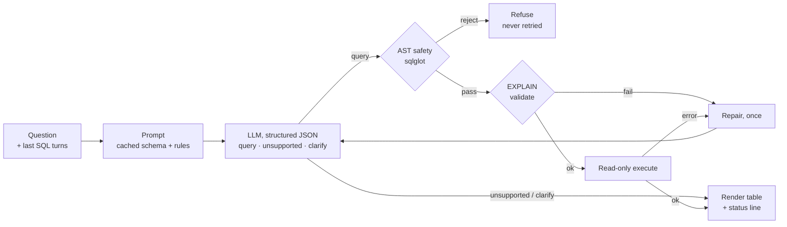
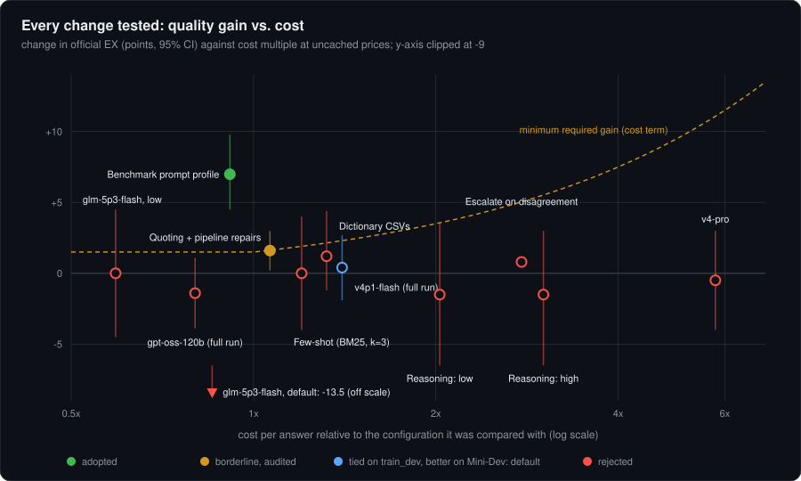

<div align="center">

# Trellis

**A schema-grounded, safety-first text-to-SQL agent. Bounded, instrumented, and measured against BIRD.**


</div>

Trellis turns a question into SQL that is grounded in the database's real schema. A SQL-AST
safety layer checks that SQL before it touches the database. It runs read-only, repairs itself
at most once, and reports latency, tokens and cost for every answer under a hard spend ceiling.
The schema is the trellis: a structure the model's output has to grow along, so the
architecture optimises for grounding, not just raw model capability.

## Results

<!-- BEGIN generated:headline -->
| | BIRD Mini-Dev | BIRD dev, untouched | Both, row-weighted |
|---|---:|---:|---:|
| **Official execution accuracy** | **65.3%** | **67.6%** | **≈ 66.9%** |
| Questions × repeats | 500 × 3 | 1,036 × 1 | 1,536 rows |
| Simple / moderate / challenging | 76.6 / 62.9 / 54.6 | 71.0 / 55.6 / 65.1 | n/a |
| P50 / P90 latency | 1.36s / 2.79s | 1.37s / 3.03s | n/a |
| Cost per query, as measured | $0.000205 | $0.000167 | n/a |
| Cost per query, no prompt cache | $0.000661 | $0.000638 | $0.000651 |
| Per 1,000 queries: measured / no cache | $0.20 / $0.66 | $0.17 / $0.64 | n/a |
<!-- END generated:headline -->

Default model `deepseek-v4p1-flash` with reasoning off, frozen Phase 1 configuration, all runs
on a clean commit. Tables in this README are regenerated from the committed reports by
[`scripts/render_readme_assets.py`](scripts/render_readme_assets.py); the [provenance table](#provenance-and-timeline)
below pins each run to its commit, config and data hash.

- **History on Mini-Dev:** 47.6% (2026-09-23 baseline) → 59.3% (Phase 1 prompt and pipeline
  changes, `deepseek-v4-flash-0731`) → **65.3%** (same config and prompt hash, `deepseek-v4p1-flash`).
- **Why this default.** On the paired 500-question Mini-Dev comparison it beats the previous
  snapshot by **+5.9 [+3.2, +8.7]** points. On `train_dev` it ties (+0.4 [−1.9, +2.7]). It costs the
  same as measured ($0.000205) but is slower (P50 1.36s vs 0.97s) and about a third dearer with no
  cache. The previous snapshot is a dated model that providers retire and not every account can
  call, so it is kept for provenance only. `gpt-oss-120b` is the cheaper, faster alternative
  (−1.4 points on `train_dev`; see the [comparison](#quality-cost-and-latency)).
- **Difficulty mix differs.** Mini-Dev skews harder (148 simple / 250 moderate / 102 challenging);
  `dev_untouched` skews simple (777 / 216 / 43). That is why the two headline numbers differ.
- **Scope.** Both use BIRD's official comparator (`set(pred) == set(gold)`). This is a local run,
  **not a leaderboard submission**. The row-weighted figure is approximate because 23 Mini-Dev rows
  use Mini-Dev's own database versions. Mini-Dev has been looked at twice of a planned four; the
  earlier 45.8% figure used a stricter local metric and survives only in the
  [postmortem](docs/POSTMORTEM.md).


## Quickstart

```bash
curl -LsSf https://astral.sh/uv/install.sh | sh   # installs uv
./scripts/setup_chinook.sh                         # sample database
uv sync && cp .env.example .env                    # dependencies and local config
$EDITOR .env                                       # set FIREWORKS_API_KEY (and FIREWORKS_MODEL)
uv run trellis
```

**Bring your own key.** The key lives only in the gitignored `.env`. It is never committed,
logged, or written to the spend ledger. A `$6` shared ceiling and a `$2` per-session allowance
cap spend. A longer walkthrough, in-chat commands and troubleshooting are in
[`docs/GETTING_STARTED.md`](docs/GETTING_STARTED.md).

## How it works



In the CLI the worst case is two model calls, ever, so the P90 tail is predictable. The first
capture below shows two real refusals: the model declines both a question the schema cannot answer
and a destructive request before writing any SQL. The second capture is the AST guard fed a
`DELETE` directly, which shows the independent second layer a misbehaving model would meet.


Benchmark mode adds three guarded repairs (off in the CLI): a "did you mean" repair for unknown
identifiers, one retry of a refusal, and one re-check of an empty result. Forbidden SQL is never
retried.

## Quality, cost and latency

Accuracy is only half the story, so every configuration is scored on all three axes. These are
full `train_dev` runs (1,002 answers on four databases the prompts were never tuned on).

<!-- BEGIN generated:pareto -->
| Configuration | Official EX | P50 | P90 | $/query measured | $/query no cache | $ per 1k (no cache) | Verdict |
|---|---:|---:|---:|---:|---:|---:|---|
| Baseline, product prompt (`deepseek-v4-flash-0731`) | 60.1% | n/v | n/v | $0.000293 | $0.000511 | $0.51 | starting point |
| + benchmark prompt profile | 67.1% | 1.22s | 8.46s | $0.000278 | $0.000467 | $0.47 | adopted |
| + quoting + pipeline repairs (the frozen config) | 68.7% | 1.05s | 8.46s | $0.000398 | $0.000497 | $0.50 | adopted |
| **same config on `deepseek-v4p1-flash` (default)** | 69.4% | 1.50s | 3.03s | $0.000141 | $0.000696 | $0.70 | **default**: ties here, +5.9 on Mini-Dev |
| `gpt-oss-120b`, low effort, same config | 67.3% | 0.97s | 1.93s | $0.000166 | $0.000398 | $0.40 | cheaper and faster; misses the non-inferiority margin |
<!-- END generated:pareto -->

*n/v: latency for the baseline run is invalid, because synchronous scoring blocked the event loop.
"No cache" prices every prompt token at the full rate, computed from the recorded token counts. It
is the fair cost axis: provider cache hits swung the measured cost between 23% and 46% across
comparable runs, so a warm-cache figure alone flatters. At 30,000 queries a day the default
costs about **$6** with a warm cache and about **$20** without one.*



Every point is a paired comparison against the configuration it was tested against. The dashed
line is the minimum gain the acceptance rule demands at that cost (train_dev comparisons only).

### Experiment ledger

Each change declares its minimum gain before it runs, and it is adopted only if both the
row-weighted and the database-macro gain clear it. The ledger records rejections too.

| Change | Δ official EX (95% CI) | Cost, latency | Verdict |
|---|---|---|---|
| Benchmark prompt profile | **+7.0** [+4.5, +9.8] | −8.6% cost, P50 1.13 → 1.22s | ✅ adopted |
| Quoting + pipeline repairs | +1.6 [+0.2, +3.0]; macro **+3.9** [+1.1, +7.1] | +6.4% cost, P50 1.22 → 1.05s | ⚠️ borderline, adopted after audit |
| Dictionary CSVs in the prompt | +1.2 [−1.2, +4.4] | +32% cost, P50 1.02 → 1.48s | ❌ below the +2.6 needed |
| Reasoning, low / high | −1.5 / −1.5 | +103% / +201% cost, P50 4.9s / 5.9s | ❌ overthinks BIRD's literal gold |
| Retrieved few-shot (BM25, k=3) | +0.0 [−4.0, +4.0] | +20% cost, P50 1.16 → 2.01s | ❌ examples do not transfer conventions |
| Swap to gpt-oss-120b | −1.4 [−3.9, +1.1] | −20% cost, P50 1.05 → 0.97s | ❌ lower bound breaks the −1.5 margin |
| glm-5p3-flash, low effort | +0.0 [−4.5, +4.5] | −41% cost, P50 1.16 → 1.93s | ❌ slower for the same accuracy |
| deepseek-v4-pro | −0.5 [−4.0, +3.0] | 5.8× cost, P50 3.78s | ❌ |
| Escalate disagreements to glm-5p3 | +0.8 | 2.8× cost | ❌ |
| deepseek-v4p1-flash, `train_dev` (full) | +0.4 [−1.9, +2.7]; macro +1.5 [−0.7, +3.9] | +40% no-cache cost, P50 1.05 → 1.61s | ➖ ties; misses the +2.9 needed as a swap |
| deepseek-v4p1-flash, Mini-Dev (paired, pilot mode) | **+5.9** [+3.2, +8.7]; macro +5.9 [+2.9, +8.8] | +35% no-cache cost, P50 0.97 → 1.36s | ✅ adopted as the default (wins where the questions are harder) |

**What the ledger says about the ceiling.** Self-consistency at K=4 adds nothing: majority@4 is
69.0% against 69.2% at K=1. One model's oracle pass@4 is 73.0%, and an oracle over five different
models (one answer each) is also 73%, so the errors are shared. Reading the 24 of 100 pilot
questions that no model ever matched, 17 are label or question errors in the benchmark itself, so
the practical ceiling on `train_dev` is about 82%. What still moves the score is BIRD's annotation
conventions, not more model diversity.

## Provenance and timeline

Every headline number comes from one run. Each row pins when it ran, on which code, and on which
data and configuration, so anyone can tell whether a result is reproducible from a given commit.

<!-- BEGIN generated:provenance -->
| Run (UTC) | Set | Model | Answers | Official EX | Commit | Tree | Config | Data |
|---|---|---|---:|---:|---|---|---|---|
| 2026-09-24 00:53 | train_dev baseline (product prompt) | `deepseek-v4-flash-0731` | 1,002 | 60.1% | `5a69af6` | clean | `76ed4867` | `e5503cce` |
| 2026-09-24 17:07 | train_dev + benchmark profile | `deepseek-v4-flash-0731` | 1,002 | 67.1% | `6d18d06` | dirty `18243ce1` | `e7fc10c4` | `e5503cce` |
| 2026-09-24 17:57 | train_dev + quoting and repairs | `deepseek-v4-flash-0731` | 1,002 | 68.7% | `1694580` | dirty `47a379b8` | `a5a42bc0` | `e5503cce` |
| 2026-09-24 23:23 | Mini-Dev, gate 1 | `deepseek-v4-flash-0731` | 1,500 | 59.3% | `285272c` | clean | `92e1c3cb` | `4ba5fa8d` |
| 2026-09-25 01:52 | dev_untouched | `deepseek-v4-flash-0731` | 1,036 | 63.6% | `a9ab833` | dirty `9e2f8c8c` | `e0ecfba5` | `b0aed7f6` |
| 2026-09-26 20:38 | train_dev, v4p1-flash | `deepseek-v4p1-flash` | 1,002 | 69.1% | `a9ab833` | dirty `48db653b` | `baff9689` | `e5503cce` |
| 2026-09-26 21:15 | Mini-Dev, gate 2 | `deepseek-v4p1-flash` | 1,500 | 65.3% | `eafe2ba` | clean | `baff9689` | `4ba5fa8d` |
| 2026-09-26 21:21 | dev_untouched | `deepseek-v4p1-flash` | 1,036 | 67.6% | `eafe2ba` | clean | `baff9689` | `b0aed7f6` |
| 2026-09-26 21:27 | train_dev, v4p1-flash, clean reproduction | `deepseek-v4p1-flash` | 1,002 | 69.4% | `eafe2ba` | clean | `baff9689` | `e5503cce` |
<!-- END generated:provenance -->

- **Run (UTC)** is when the run finished, and is the id in its files,
  `benchmark/results/bird_raw_<id>.jsonl` and `bird_meta_<id>.json`. **Commit** and **Tree** record the code: `clean` means the run
  used exactly that commit; `dirty <hash>` means it ran with uncommitted edits that the hash pins but the
  commit alone cannot recreate. The runs on `deepseek-v4p1-flash` at commit `eafe2ba` are clean.
- **Config** hashes the model, prompt profile, quoting, repairs, temperature, token limit,
  reasoning effort and timeout. **Data** hashes the question file. The effective prompt hash
  (`4b52d7aa`) is the same at both Mini-Dev gates, so the only variable between them is the model.
- **Reproduction check.** The `train_dev` config was run twice on `deepseek-v4p1-flash`: 69.1% on an
  uncommitted tree, then 69.4% on the clean commit. That is within run-to-run noise, so a fresh run
  of the frozen config should land within a point or so of the published figures.
- `analyze flips` refuses to compare runs that differ in anything except the variable declared
  under test, and acceptance requires the gain to clear a minimum set before the run.
- The Mini-Dev gate numbers, per-database tables and failure lists are in
  [`bird_report_minidev_gate2_v4p1.md`](benchmark/results/bird_report_minidev_gate2_v4p1.md);
  the paired comparison with gate 1 is in
  [`flips_minidev_gate1_vs_gate2_v4p1.md`](benchmark/results/flips_minidev_gate1_vs_gate2_v4p1.md).

## Engineering decisions that matter

- **AST safety, not a keyword blocklist.** `sqlglot` walks the whole statement, including CTEs and
  subqueries, and rejects anything that is not a read-only `SELECT` or `WITH`, names an unknown
  table or column, or calls a forbidden function. SQLite's authorizer, `query_only` and a
  read-only URI connection sit underneath as an independent second layer.
- **Bounded repair, not an open loop.** One repair after a validation or execution failure, and
  none after a safety rejection. Predictable tail latency in exchange for the occasional
  unrecovered hard query.
- **Structured output.** The model returns `{response_type, sql, message}`. That removes fence
  stripping and prose, and `unsupported` and `clarify` stop it inventing SQL for questions the
  schema cannot answer.
- **SQL-only memory.** Follow-ups need the query being refined, not its result rows, so history
  stays small and no result values persist across turns.
- **One schema introspector.** `src/schema.py` builds the prompt block from live `PRAGMA` calls,
  which is why the same agent runs unmodified on Chinook and all 11 BIRD databases.
- **Reserve, then settle.** Every call reserves a worst-case cost under a lock before dispatch and
  settles to the actual cost afterwards, so concurrent requests can never overshoot the ceiling.
- **No agent framework.** A framework would hide the per-stage timings (`t_schema`, `t_llm`,
  `t_exec`, `t_repair`) this project exists to measure.

**How results are protected from self-deception.** Runs are pinned by content (database hashes,
effective prompt, config, code state) and refuse comparison if anything but the declared variable
differs. Iteration happens on held-out train databases, with a separate lockbox and Mini-Dev used
only as an infrequent gate (1 of 4 looks used). Mini-Dev failures were read in the
[postmortem](docs/POSTMORTEM.md) to find causes, so it is a gate, not an untouched set. One
cross-process ledger enforces spend. The full dated log, including reversals, is in
[`docs/DECISIONS.md`](docs/DECISIONS.md).

## Reproduce

The frozen configuration (`config baff9689`) runs on the default model with no extra flags beyond
the ones below. `--budget` is the ledger ceiling in dollars, so a run stops before overspending.

```bash
uvx --with-editable . pytest && uvx --with-editable . ruff check src benchmark tests
uv run python -m benchmark.preflight --models accounts/fireworks/models/deepseek-v4p1-flash  # is the model callable?
./scripts/setup_bird_minidev.sh           # ~800MB download, data/bird/ is gitignored

# BIRD Mini-Dev, 500 x 3 (about $0.3, about 40 minutes at concurrency 8)
uv run python -m benchmark.run_bird --prompt-profile benchmark --quote-identifiers \
  --pipeline-repairs --reasoning-effort none --llm-timeout 60 --repeats 3 --concurrency 8 \
  --seed 0 --budget 6.00 --report benchmark/results/bird_report_mine.md

# Chinook dev set, product prompt, with the raw-prompt control arm
uv run python -m benchmark.run_bench --models accounts/fireworks/models/deepseek-v4p1-flash \
  --repeats 3 --arms agent baseline --budget 6.00

uv run python scripts/render_readme_assets.py    # regenerate this page's charts and tables
```

Scores move a little from run to run even at temperature 0 (two identical runs disagreed on about
10% of questions), so compare to the paired intervals above, not to a single decimal place.

### Chinook dev set

The 10 questions this project wrote, with the product prompt and the raw-prompt control, 3 repeats
at concurrency 1 (the authoritative latency setting), run 2026-09-26 21:30 UTC at commit `eafe2ba` (clean),
questions hash `ebbc3af8`, report [`report_chinook_v4p1.md`](benchmark/results/report_chinook_v4p1.md):

| Arm | Exec accuracy | P50 | P90 | $/query | $ per day at 30k |
|---|---:|---:|---:|---:|---:|
| Trellis agent | **53.3%** | 1.59s | 2.65s | $0.000292 | $8.76 |
| Raw-prompt control (no schema, safety or repair) | 0.0% | 2.72s | 3.75s | $0.000246 | $7.37 |

This is fast-iteration evidence, not an accuracy claim. Strictly scored, the agent misses the same four
questions as on the previous snapshot (q_003, q_006, q_008, q_009, which were hand-inspected and are
mostly evaluation-contract mismatches rather than wrong answers) and, in 2 of 3 repeats, q_007. On
q_007 every repeat returned the right value (449.46), but two added a `Year` column that the strict
comparison rejects. The previous snapshot scored 60% on the same questions.


## Limits and next steps

| Gap | Why it matters |
|---|---|
| No automatic fallback if a model or the provider is unavailable | An unavailable model now returns a clear `model-unavailable` error with a fix hint, but nothing switches to a second model on its own |
| Scores are local, not a leaderboard submission; `train_lockbox` is unused | Only the hidden test set can back a claim like ">80%". The lockbox is reserved for the final frozen configuration |
| The ceiling is generation, not selection | Pass@K stays near 73%, so the next lever is teaching BIRD conventions (fine-tuning gate), not sampling more |
| One shared conversation and budget | A multi-user product needs per-user isolation and rate limits |
| No PII masking or column-level redaction | Results are returned as plain values; needs governance review before real data |
| Schemas tested up to BIRD's largest database | Hundreds of tables need retrieval, not full-schema-in-prompt |
| Execution accuracy only | BIRD's soft-F1 and R-VES are not implemented |

## Repo map

```
src/         agent, CLI, schema introspection, safety and validation, LLM client, costs
benchmark/   BIRD and Chinook runners, evaluators, paired-comparison analysis, reports
scripts/     dataset setup, README asset generator
data/        Chinook.db and dev questions; data/bird/ is fetched on demand
docs/        GETTING_STARTED · SOTA_PLAN · POSTMORTEM · DECISIONS · BUILD_PLAN · AI_USAGE
tests/       pytest suite; no live API calls (the model client is mocked)
```

[MIT](LICENSE).
